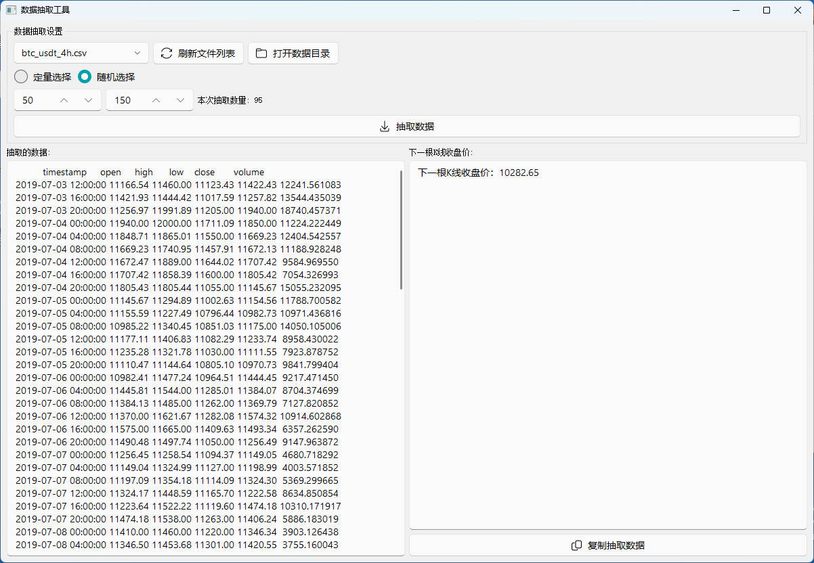

# KlineSampler

### 定量/随机抽取连续K线数据并输出下一根K线收盘价  
### Extract continuous K-line sequences (quantitative/random sampling) and output the next closing price  

### 无聊的小项目，功能如简介所述仅此而已  
### Just a simple tool that does exactly what the description says - nothing more  

  
<del>或许能用来测试某个对话大模型能否准确预测K线价格？</del>  
<del>Might be useful to test if an LLM can accurately predict candlestick prices?</del>  

**相关项目**  
**Related Projects**  
[PyQt-Fluent-Widgets](https://github.com/zhiyiYo/PyQt-Fluent-Widgets)  
